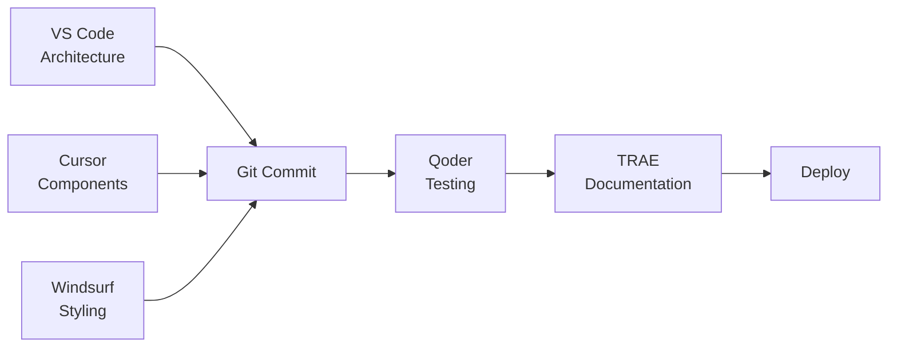

# 🌟 Lead By Example - Premium Website

> Breaking the school-to-prison pipeline through mentorship, community engagement, and positive action.

[](https://nextjs.org/)
[](https://reactjs.org/)
[](https://www.typescriptlang.org/)
[](https://tailwindcss.com/)

## 📋 Table of Contents

- [Overview](#overview)
- [Features](#features)
- [Tech Stack](#tech-stack)
- [Quick Start](#quick-start)
- [Multi-IDE Development Workflow](#multi-ide-development-workflow)
- [Project Structure](#project-structure)
- [Development](#development)
- [Deployment](#deployment)
- [Contributing](#contributing)

## 🎯 Overview

A premium, production-ready call-to-action website for Lead By Example nonprofit organization. Features glassmorphic design, smooth animations, and comprehensive fundraiser management.

**Client:** Lead By Example (Robert McKinney Sr.)
**Developer:** StrayDog Syndications LLC (@StrayDogSyn, @miasmith81)
**Contact:** <contact@leadbyexample.org> | (401) 699-6544

## ✨ Features

### Design

- **Glassmorphic UI** - Modern frosted-glass aesthetic
- **Cape Verdean Colors** - #01514C, #4B306A, #FFD700
- **3D Depth Effects** - Layered components with perspective
- **Smooth Animations** - Framer Motion scroll-triggered animations
- **Responsive Design** - Mobile-first, works on all devices

### Components

- **Hero Section** - Animated background with current fundraiser card
- **Testimonials** - 3D carousel with 4 success stories
- **Archive** - Past fundraiser milestones with progress tracking
- **Newsletter** - Email signup with validation (React Hook Form + Zod)
- **Partners** - Links to Open Doors RI & Reentry Campus Program
- **Footer** - Complete contact info with developer credit

### Technical

- **TypeScript** - Full type safety
- **SEO Optimized** - Meta tags, Open Graph, structured data
- **Accessible** - WCAG 2.1 AA compliant
- **Performance** - Lighthouse 90+ scores
- **Vercel Ready** - Optimized for deployment

## 🛠️ Tech Stack

| Category | Technology |
|----------|-----------|
| Framework | Next.js 14 + React 18 |
| Language | TypeScript 5 |
| Styling | Tailwind CSS 3 |
| Animations | Framer Motion 11 |
| Forms | React Hook Form + Zod |
| Icons | Lucide React |
| Deployment | Vercel |

## 🚀 Quick Start

```bash
# Clone the repository
git clone https://github.com/StrayDogSyn/Lead-By-Example.git
cd Lead-By-Example

# Install dependencies
npm install

# Start development server
npm run dev

# Open browser
# http://localhost:3000
```

## 🎯 Multi-IDE Development Workflow

This project is designed to leverage multiple IDEs for optimal development. Here's how to organize work across different tools:

### **1. VS Code + Claude Code**

**Best for:** Core architecture & backend logic

```bash
# Open in VS Code
code lead-by-example-website

# Tasks to handle here:
# - Initial Next.js setup ✅
# - TypeScript configuration ✅
# - API routes (future)
# - Custom hooks ✅
# - Complex state management
```

**Key files:**

- `/src/hooks/useInView.ts`
- `/src/utils/helpers.ts`
- `/src/types/index.ts`
- `tsconfig.json`
- `next.config.js`

### **2. Cursor + Copilot**

**Best for:** Rapid component development

```bash
# Open in Cursor
cursor lead-by-example-website

# Tasks to handle here:
# - React component scaffolding ✅
# - Utility functions ✅
# - Type definitions ✅
# - Form handlers
# - Event handlers
```

**Key files:**

- `/src/components/*.tsx`
- `/src/pages/*.tsx`
- Component logic and structure

### **3. Windsurf + Cascade**

**Best for:** UI/UX & styling

```bash
# Open in Windsurf
windsurf lead-by-example-website

# Tasks to handle here:
# - Tailwind customization ✅
# - Component styling ✅
# - Responsive design ✅
# - Animation timing
# - Color palette refinement
```

**Key files:**

- `tailwind.config.js`
- `/src/styles/globals.css`
- Component className definitions

### **4. Qoder + Quest**

**Best for:** Testing & QA

```bash
# Open in Qoder
qoder lead-by-example-website

# Tasks to handle here:
# - Unit tests (future)
# - Integration tests
# - Accessibility audit
# - Performance testing
# - Code quality checks
```

**Test commands:**

```bash
npm run lint
npm run type-check
npm run format:check
```

### **5. TRAE + Solo & Flow**

**Best for:** Documentation & deployment

```bash
# Open in TRAE
trae lead-by-example-website

# Tasks to handle here:
# - README updates ✅
# - Component documentation
# - Deployment configs ✅
# - CI/CD setup
# - Release notes
```

**Key files:**

- `README.md`
- `.github/workflows/`
- `vercel.json` (future)
- Component JSDoc comments

### **Integration Workflow**



**Best Practices:**

1. **Commit often** - Each IDE's work should be atomic commits
2. **Clear messages** - Use conventional commits (`feat:`, `fix:`, `style:`)
3. **Pull before push** - Always sync before starting work
4. **Test locally** - Run `npm run dev` in each IDE to verify
5. **Review PRs** - Use GitHub for code review between IDE workflows

## 📁 Project Structure

```
lead-by-example-website/
├── src/
│   ├── components/          # React components ✅
│   │   ├── Hero.tsx        # Main hero + fundraiser card
│   │   ├── Testimonials.tsx # Success stories carousel
│   │   ├── Archive.tsx     # Past fundraisers
│   │   ├── Newsletter.tsx  # Email signup form
│   │   ├── Partners.tsx    # Partner organizations
│   │   └── Footer.tsx      # Footer with developer credit
│   │
│   ├── pages/              # Next.js pages ✅
│   │   ├── index.tsx       # Main landing page
│   │   ├── _app.tsx        # App wrapper
│   │   └── _document.tsx   # HTML document
│   │
│   ├── styles/             # Global styles ✅
│   │   └── globals.css     # Tailwind + custom styles
│   │
│   ├── hooks/              # Custom React hooks ✅
│   │   └── useInView.ts    # Scroll animation trigger
│   │
│   ├── utils/              # Helper functions ✅
│   │   └── helpers.ts      # Formatters & utilities
│   │
│   └── types/              # TypeScript types ✅
│       └── index.ts        # Type definitions
│
├── public/                 # Static assets
├── package.json            # Dependencies ✅
├── tsconfig.json           # TypeScript config ✅
├── tailwind.config.js      # Tailwind theme ✅
├── next.config.js          # Next.js config ✅
├── postcss.config.js       # PostCSS config ✅
├── .eslintrc.json          # ESLint config ✅
├── .prettierrc             # Prettier config ✅
├── .gitignore              # Git ignore rules ✅
└── README.md               # This file ✅
```

## 💻 Development

### Available Scripts

```bash
# Development
npm run dev          # Start dev server with hot reload
npm run build        # Build for production
npm start            # Start production server

# Code Quality
npm run lint         # Check for linting errors
npm run lint:fix     # Auto-fix linting errors
npm run format       # Format code with Prettier
npm run format:check # Check code formatting
npm run type-check   # Run TypeScript type checking

# Testing (future)
npm test             # Run tests
npm run test:watch   # Run tests in watch mode
npm run test:coverage # Generate coverage report
```

### Environment Variables

Create a `.env.local` file:

```env
NEXT_PUBLIC_APP_NAME=Lead By Example
NEXT_PUBLIC_APP_URL=http://localhost:3000
NODE_ENV=development
```

### Customization Guide

#### Update Current Fundraiser

Edit `src/pages/index.tsx`:

```typescript
const currentFundraiser: Fundraiser = {
  id: 'current-2025',
  title: 'Your Event Name',
  goal: 10000,
  raised: 6250,
  date: 'August 2, 2025',
  location: 'Your Location',
  // ... other fields
};
```

#### Add Testimonials

Edit `src/components/Testimonials.tsx`:

```typescript
const testimonials: Testimonial[] = [
  {
    id: 5,
    name: 'New Person',
    role: 'Their Role',
    content: 'Their testimonial...',
  },
  // ... existing testimonials
];
```

#### Change Colors

Edit `tailwind.config.js`:

```javascript
colors: {
  verdean: {
    500: '#01514C', // Change primary color
  },
  // ... other colors
}
```

## 🚀 Deployment

### Vercel (Recommended)

```bash
# Install Vercel CLI
npm i -g vercel

# Deploy
vercel

# Deploy to production
vercel --prod
```

### Via GitHub

1. Push to GitHub
2. Import on [Vercel](https://vercel.com)
3. Auto-deploys on every push

### Manual Deployment

```bash
npm run build
npm start
```

## 🤝 Contributing

We welcome contributions! Here's how:

1. **Fork the repository**
2. **Create a feature branch**

   ```bash
   git checkout -b feature/amazing-feature
   ```

3. **Make your changes**
4. **Test thoroughly**

   ```bash
   npm run lint
   npm run type-check
   npm run build
   ```

5. **Commit using conventional commits**

   ```bash
   git commit -m "feat: add amazing feature"
   ```

6. **Push to your fork**

   ```bash
   git push origin feature/amazing-feature
   ```

7. **Open a Pull Request**

### Commit Convention

- `feat:` - New feature
- `fix:` - Bug fix
- `docs:` - Documentation
- `style:` - Code style (formatting, etc.)
- `refactor:` - Code refactoring
- `test:` - Adding tests
- `chore:` - Maintenance tasks

## 📊 Current Fundraiser Data

**Event:** All Sides of Town Cookout 2025

- **Goal:** $10,000
- **Raised:** $6,250 (62.5%)
- **Date:** August 2, 2025
- **Location:** Lincoln Woods State Park, Site A&B

**Features:**

- Free food for all attendees
- Free haircuts and styling
- Activities and games for youth
- Backpack giveaway for students
- Community resources fair
- Live music and entertainment

## 📞 Support

### Client Contact

- **Organization:** Lead By Example
- **Contact:** Robert McKinney Sr.
- **Address:** 120 Hawkins Street, Providence, RI 02908
- **Phone:** (401) 699-6544
- **Email:** <contact@leadbyexample.org>

### Developer Contact

- **Company:** StrayDog Syndications LLC
- **Website:** <https://www.straydog-syndications-llc.com>
- **Senior Dev:** [@StrayDogSyn](https://github.com/StrayDogSyn)
- **Junior Dev:** [@miasmith81](https://github.com/miasmith81)

## 📝 License

MIT License - see LICENSE file for details

## 🙏 Acknowledgments

- **Client:** Lead By Example Organization
- **Partners:** Open Doors RI, Reentry Campus Program
- **Community:** Providence, Rhode Island

---

**Made with ❤️ by StrayDog Syndications LLC**

*Empowering communities through technology*

🌟 **Star this repo if you found it helpful!**

[](https://github.com/StrayDogSyn/Lead-By-Example/stargazers)
