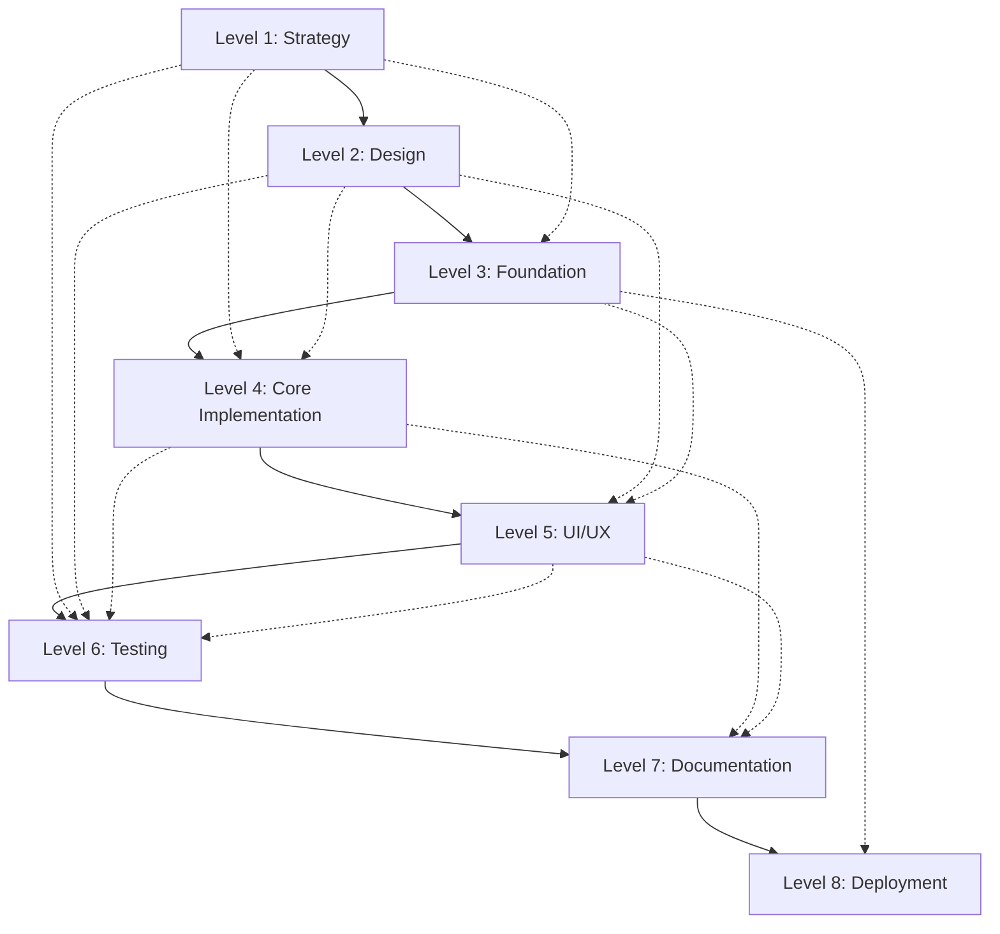

# 🌊 Windsurf + Cascade Mode Development Guide

## Overview

**Windsurf + Cascade Mode** is a sequential, flowing development methodology that emphasizes contextual awareness and continuous integration. This approach builds layers of implementation where each level inherits context from previous levels, creating a natural waterfall-like flow from planning to deployment.

**Timeline:** 8-10 hours  
**Difficulty:** ⭐⭐⭐ (Intermediate)  
**Best For:** Developers who prefer waterfall methodology, contextual awareness, sequential progress, and continuous integration

---

## 🎯 When to Choose Windsurf + Cascade Mode

### ✅ Choose This Mode If You:
- **Prefer waterfall methodology** over agile iterations
- **Value contextual awareness** throughout development
- **Like sequential progress** with clear milestones
- **Want continuous integration** at every level
- **Need comprehensive documentation** generation
- **Require predictable timelines** and structured approach

### ❌ Consider Other Modes If You:
- Need rapid prototyping (use Qoder Quest Mode)
- Prefer iterative development cycles
- Want maximum flexibility in approach
- Work better with parallel development streams

---

## 🌊 The 8 Cascade Levels

The Windsurf + Cascade Mode follows 8 distinct levels, each building upon the previous with automatic context inheritance:

### Level 1: 🎯 Strategic Planning & Architecture
**Duration:** 1-1.5 hours  
**Focus:** High-level system design and strategic decisions

#### Key Activities:
- **Requirements Analysis**: Define functional and non-functional requirements
- **Architecture Design**: Create system architecture diagrams
- **Technology Stack Selection**: Choose frameworks, libraries, and tools
- **Risk Assessment**: Identify potential challenges and mitigation strategies
- **Success Metrics**: Define measurable outcomes

#### Deliverables:
- Architecture documentation
- Technology stack rationale
- Risk mitigation plan
- Success criteria definition

#### Context Inheritance:
- Project requirements flow to all subsequent levels
- Architectural decisions constrain implementation choices
- Risk factors inform validation strategies

---

### Level 2: 📋 Detailed Design & Specifications
**Duration:** 1-1.5 hours  
**Focus:** Detailed component design and interface specifications

#### Key Activities:
- **Component Design**: Break down architecture into implementable components
- **API Specifications**: Define interfaces, endpoints, and data contracts
- **Database Schema**: Design data models and relationships
- **UI/UX Wireframes**: Create user interface mockups
- **Integration Points**: Define how components interact

#### Deliverables:
- Component specifications
- API documentation
- Database schema
- UI/UX wireframes
- Integration diagrams

#### Context Inheritance:
- Architecture constraints from Level 1
- Component interfaces inform implementation
- Design patterns cascade to development

---

### Level 3: 🏗️ Foundation & Infrastructure Setup
**Duration:** 1-1.5 hours  
**Focus:** Project scaffolding and infrastructure preparation

#### Key Activities:
- **Project Initialization**: Set up development environment
- **Dependency Management**: Configure package managers and dependencies
- **Build System**: Establish build and deployment pipelines
- **Development Tools**: Configure linting, formatting, and testing tools
- **Environment Configuration**: Set up development, staging, and production environments

#### Deliverables:
- Project scaffold
- Build configuration
- Development environment setup
- CI/CD pipeline foundation
- Environment configuration files

#### Context Inheritance:
- Technology choices from Level 1 & 2
- Build requirements inform tooling
- Environment needs cascade to deployment

---

### Level 4: 🔧 Core Implementation
**Duration:** 2-3 hours  
**Focus:** Primary feature development and core functionality

#### Key Activities:
- **Core Logic Implementation**: Build primary business logic
- **Data Layer Development**: Implement database interactions
- **Service Layer Creation**: Build application services and utilities
- **Component Development**: Create reusable UI components
- **Integration Implementation**: Connect system components

#### Deliverables:
- Core application logic
- Data access layer
- Service implementations
- UI component library
- Integration modules

#### Context Inheritance:
- Design specifications from Level 2
- Infrastructure setup from Level 3
- Component interfaces guide implementation
- Validation requirements inform testing

---

### Level 5: 🎨 User Interface & Experience
**Duration:** 1-2 hours  
**Focus:** Frontend development and user experience optimization

#### Key Activities:
- **UI Component Assembly**: Combine components into complete interfaces
- **Responsive Design**: Ensure cross-device compatibility
- **User Flow Implementation**: Build complete user journeys
- **Accessibility Features**: Implement WCAG compliance
- **Performance Optimization**: Optimize frontend performance

#### Deliverables:
- Complete user interfaces
- Responsive layouts
- Accessibility features
- Performance optimizations
- User experience flows

#### Context Inheritance:
- UI specifications from Level 2
- Component library from Level 4
- Performance requirements from Level 1
- User needs inform UX decisions

---

### Level 6: 🧪 Testing & Quality Assurance
**Duration:** 1-1.5 hours  
**Focus:** Comprehensive testing and quality validation

#### Key Activities:
- **Unit Testing**: Test individual components and functions
- **Integration Testing**: Validate component interactions
- **End-to-End Testing**: Test complete user workflows
- **Performance Testing**: Validate system performance
- **Security Testing**: Check for vulnerabilities

#### Deliverables:
- Unit test suite
- Integration tests
- E2E test scenarios
- Performance benchmarks
- Security audit results

#### Context Inheritance:
- Requirements from Level 1 inform test cases
- Component specifications guide unit tests
- User flows from Level 5 define E2E tests
- Performance criteria validate optimization

---

### Level 7: 📚 Documentation & Knowledge Transfer
**Duration:** 1 hour  
**Focus:** Comprehensive documentation and knowledge sharing

#### Key Activities:
- **Technical Documentation**: Document APIs, components, and architecture
- **User Documentation**: Create user guides and tutorials
- **Deployment Guides**: Document deployment procedures
- **Maintenance Documentation**: Create troubleshooting and maintenance guides
- **Knowledge Base**: Build searchable documentation

#### Deliverables:
- API documentation
- User guides
- Deployment documentation
- Maintenance procedures
- Knowledge base articles

#### Context Inheritance:
- All previous levels contribute to documentation
- Implementation details inform technical docs
- User flows guide user documentation
- Infrastructure setup informs deployment guides

---

### Level 8: 🚀 Deployment & Monitoring
**Duration:** 1 hour  
**Focus:** Production deployment and monitoring setup

#### Key Activities:
- **Production Deployment**: Deploy to production environment
- **Monitoring Setup**: Configure application and infrastructure monitoring
- **Alerting Configuration**: Set up automated alerts and notifications
- **Performance Monitoring**: Track application performance metrics
- **User Analytics**: Implement user behavior tracking

#### Deliverables:
- Production deployment
- Monitoring dashboards
- Alert configurations
- Performance metrics
- Analytics setup

#### Context Inheritance:
- Infrastructure from Level 3 enables deployment
- Performance requirements from Level 1 guide monitoring
- Test results from Level 6 inform health checks
- Documentation from Level 7 supports operations

---

## 🔄 Context Inheritance Mechanisms

### Automatic Context Flow
Each level automatically inherits relevant context from previous levels:



### Context Types
1. **Requirements Context**: User needs and business requirements
2. **Technical Context**: Architecture decisions and constraints
3. **Implementation Context**: Code patterns and component interfaces
4. **Quality Context**: Testing strategies and performance criteria
5. **Operational Context**: Deployment and monitoring requirements

---

## 🎛️ Intelligent Flow Control

### Validation Gates
Each level includes validation gates that must pass before proceeding:

#### Level 1 → Level 2 Gate
- [ ] Architecture review completed
- [ ] Technology stack approved
- [ ] Risk assessment documented
- [ ] Success criteria defined

#### Level 2 → Level 3 Gate
- [ ] Component specifications reviewed
- [ ] API contracts defined
- [ ] Database schema validated
- [ ] UI/UX approved

#### Level 3 → Level 4 Gate
- [ ] Development environment functional
- [ ] Build system operational
- [ ] Dependencies resolved
- [ ] CI/CD pipeline configured

#### Level 4 → Level 5 Gate
- [ ] Core functionality implemented
- [ ] Unit tests passing
- [ ] Integration points working
- [ ] Code review completed

#### Level 5 → Level 6 Gate
- [ ] UI components functional
- [ ] User flows complete
- [ ] Responsive design verified
- [ ] Accessibility features implemented

#### Level 6 → Level 7 Gate
- [ ] All tests passing
- [ ] Performance benchmarks met
- [ ] Security audit completed
- [ ] Quality gates satisfied

#### Level 7 → Level 8 Gate
- [ ] Documentation complete
- [ ] Deployment procedures tested
- [ ] Knowledge transfer completed
- [ ] Maintenance guides available

### Rollback Mechanisms
If validation fails at any gate:
1. **Identify Root Cause**: Analyze why validation failed
2. **Rollback to Previous Level**: Return to the last successful level
3. **Address Issues**: Fix problems identified in validation
4. **Re-validate**: Ensure fixes resolve the issues
5. **Proceed**: Continue to next level once validation passes

---

## 🔍 Real-Time Validation

### Continuous Validation Strategies

#### Code Quality Validation
```typescript
// Example: Automated code quality checks
interface ValidationResult {
  level: CascadeLevel;
  status: 'pass' | 'fail' | 'warning';
  issues: ValidationIssue[];
  recommendations: string[];
}

class CascadeValidator {
  validateLevel(level: CascadeLevel): ValidationResult {
    const checks = this.getValidationChecks(level);
    const results = checks.map(check => check.execute());
    
    return {
      level,
      status: this.aggregateStatus(results),
      issues: this.extractIssues(results),
      recommendations: this.generateRecommendations(results)
    };
  }
}
```

#### Performance Validation
```typescript
// Example: Performance monitoring at each level
class PerformanceValidator {
  async validatePerformance(level: CascadeLevel): Promise<PerformanceResult> {
    const metrics = await this.collectMetrics(level);
    const benchmarks = this.getBenchmarks(level);
    
    return {
      level,
      metrics,
      benchmarks,
      passed: this.compareToBenchmarks(metrics, benchmarks),
      recommendations: this.generateOptimizations(metrics, benchmarks)
    };
  }
}
```

### Validation Checkpoints
- **Entry Validation**: Verify prerequisites before starting each level
- **Progress Validation**: Monitor progress during level execution
- **Exit Validation**: Confirm completion criteria before advancing
- **Cross-Level Validation**: Ensure consistency across levels

---

## 📖 Documentation Generation

### Automatic Documentation Features

#### Architecture Documentation
```typescript
// Example: Auto-generated architecture docs
interface ArchitectureDoc {
  overview: string;
  components: ComponentSpec[];
  dataFlow: DataFlowDiagram;
  integrations: IntegrationPoint[];
  deploymentModel: DeploymentSpec;
}

class DocumentationGenerator {
  generateArchitectureDoc(cascade: CascadeContext): ArchitectureDoc {
    return {
      overview: this.extractOverview(cascade.level1),
      components: this.extractComponents(cascade.level2),
      dataFlow: this.generateDataFlow(cascade.level4),
      integrations: this.extractIntegrations(cascade.level4),
      deploymentModel: this.extractDeployment(cascade.level8)
    };
  }
}
```

#### API Documentation
```typescript
// Example: Auto-generated API docs
interface APIDocumentation {
  endpoints: EndpointSpec[];
  schemas: SchemaDefinition[];
  examples: RequestResponseExample[];
  authentication: AuthSpec;
}

class APIDocGenerator {
  generateAPIDoc(implementation: CoreImplementation): APIDocumentation {
    return {
      endpoints: this.extractEndpoints(implementation),
      schemas: this.extractSchemas(implementation),
      examples: this.generateExamples(implementation),
      authentication: this.extractAuthSpec(implementation)
    };
  }
}
```

### Documentation Types Generated
1. **Technical Documentation**: API specs, component docs, architecture guides
2. **User Documentation**: User guides, tutorials, FAQ
3. **Operational Documentation**: Deployment guides, monitoring procedures
4. **Development Documentation**: Setup guides, contribution guidelines

---

## 🛠️ Implementation Examples

### Example 1: E-commerce Platform

#### Level 1: Strategic Planning
```yaml
# Architecture Decision Record
title: E-commerce Platform Architecture
status: approved
context: |
  Building a scalable e-commerce platform with microservices architecture
decision: |
  - Frontend: Next.js with TypeScript
  - Backend: Node.js with Express
  - Database: PostgreSQL with Redis cache
  - Payment: Stripe integration
  - Deployment: Docker + Kubernetes
consequences: |
  - Scalable microservices architecture
  - Strong typing with TypeScript
  - Fast caching with Redis
```

#### Level 2: Detailed Design
```typescript
// Component Specifications
interface ProductService {
  getProduct(id: string): Promise<Product>;
  searchProducts(criteria: SearchCriteria): Promise<Product[]>;
  createProduct(product: CreateProductRequest): Promise<Product>;
  updateProduct(id: string, updates: UpdateProductRequest): Promise<Product>;
}

interface OrderService {
  createOrder(order: CreateOrderRequest): Promise<Order>;
  getOrder(id: string): Promise<Order>;
  updateOrderStatus(id: string, status: OrderStatus): Promise<Order>;
}
```

#### Level 3: Foundation Setup
```json
{
  "name": "ecommerce-platform",
  "scripts": {
    "dev": "next dev",
    "build": "next build",
    "test": "jest",
    "lint": "eslint . --ext .ts,.tsx"
  },
  "dependencies": {
    "next": "^14.0.0",
    "react": "^18.0.0",
    "typescript": "^5.0.0",
    "express": "^4.18.0",
    "pg": "^8.8.0",
    "redis": "^4.5.0",
    "stripe": "^12.0.0"
  }
}
```

### Example 2: Task Management App

#### Cascade Flow Overview
1. **Level 1**: Define task management requirements and choose React + Firebase
2. **Level 2**: Design task, project, and user components with real-time sync
3. **Level 3**: Set up React project with Firebase SDK and authentication
4. **Level 4**: Implement task CRUD operations and real-time updates
5. **Level 5**: Create responsive UI with drag-and-drop functionality
6. **Level 6**: Test task operations, real-time sync, and user workflows
7. **Level 7**: Document API usage, user guides, and deployment steps
8. **Level 8**: Deploy to Firebase Hosting with monitoring and analytics

---

## 🚀 Getting Started

### Prerequisites
- Development environment setup
- Version control system (Git)
- Project management tools
- Testing frameworks
- Documentation tools

### Step-by-Step Startup

#### 1. Initialize Cascade Context
```typescript
interface CascadeContext {
  projectId: string;
  currentLevel: CascadeLevel;
  completedLevels: CascadeLevel[];
  validationResults: ValidationResult[];
  contextInheritance: ContextMap;
}

const cascade = new CascadeContext({
  projectId: 'my-project',
  currentLevel: CascadeLevel.STRATEGIC_PLANNING,
  completedLevels: [],
  validationResults: [],
  contextInheritance: new Map()
});
```

#### 2. Execute Level 1
```bash
# Start with strategic planning
npm run cascade:level1
# This will:
# - Gather requirements
# - Design architecture
# - Select technology stack
# - Assess risks
# - Define success criteria
```

#### 3. Validate and Progress
```bash
# Validate current level
npm run cascade:validate

# If validation passes, advance to next level
npm run cascade:advance

# If validation fails, review and fix issues
npm run cascade:review
```

### Command Line Interface
```bash
# Cascade CLI commands
cascade init [project-name]           # Initialize new cascade project
cascade level [1-8]                   # Execute specific level
cascade validate                      # Validate current level
cascade advance                       # Advance to next level
cascade rollback                      # Rollback to previous level
cascade status                        # Show current status
cascade docs                          # Generate documentation
cascade deploy                        # Execute deployment
```

---

## 📊 Progress Tracking

### Level Completion Metrics
- **Requirements Coverage**: Percentage of requirements addressed
- **Code Quality Score**: Automated code quality assessment
- **Test Coverage**: Percentage of code covered by tests
- **Documentation Completeness**: Percentage of components documented
- **Performance Benchmarks**: Performance metrics vs. targets

### Dashboard Example
```
🌊 Windsurf + Cascade Progress Dashboard

Current Level: Level 4 - Core Implementation (60% complete)
Overall Progress: 50% (4/8 levels completed)

✅ Level 1: Strategic Planning (100%)
✅ Level 2: Detailed Design (100%)
✅ Level 3: Foundation Setup (100%)
🔄 Level 4: Core Implementation (60%)
⏳ Level 5: UI/UX (0%)
⏳ Level 6: Testing (0%)
⏳ Level 7: Documentation (0%)
⏳ Level 8: Deployment (0%)

Quality Metrics:
- Code Quality: 85/100
- Test Coverage: 45%
- Documentation: 30%
- Performance: Meeting targets
```

---

## 🔧 Troubleshooting

### Common Issues and Solutions

#### Issue: Validation Gate Failure
**Symptoms**: Cannot advance to next level
**Solutions**:
1. Review validation results for specific failures
2. Address identified issues systematically
3. Re-run validation after fixes
4. Consider rollback if issues are fundamental

#### Issue: Context Inheritance Problems
**Symptoms**: Information not flowing between levels
**Solutions**:
1. Verify context mapping configuration
2. Check for missing context providers
3. Validate context serialization/deserialization
4. Review level dependencies

#### Issue: Performance Degradation
**Symptoms**: Slow execution or high resource usage
**Solutions**:
1. Profile performance at each level
2. Optimize resource-intensive operations
3. Implement caching strategies
4. Consider parallel processing where appropriate

### Debug Commands
```bash
# Debug cascade execution
cascade debug --level [1-8]          # Debug specific level
cascade debug --context              # Show context inheritance
cascade debug --validation           # Show validation details
cascade debug --performance          # Show performance metrics
```

---

## 📈 Best Practices

### Development Best Practices
1. **Maintain Context Integrity**: Ensure information flows correctly between levels
2. **Validate Early and Often**: Don't skip validation gates
3. **Document Decisions**: Record architectural and design decisions
4. **Test Continuously**: Implement testing at every level
5. **Monitor Progress**: Track metrics and adjust as needed

### Team Collaboration
1. **Clear Handoffs**: Ensure clean transitions between levels
2. **Shared Context**: Maintain shared understanding of project context
3. **Regular Reviews**: Conduct reviews at validation gates
4. **Knowledge Sharing**: Document and share learnings
5. **Continuous Improvement**: Refine process based on experience

### Quality Assurance
1. **Automated Validation**: Use automated tools for consistent validation
2. **Peer Reviews**: Include peer reviews at critical gates
3. **Performance Monitoring**: Track performance throughout development
4. **Security Checks**: Include security validation at appropriate levels
5. **User Feedback**: Incorporate user feedback early and often

---

## 🎯 Success Metrics

### Project Success Indicators
- **On-Time Delivery**: Project completed within estimated timeline
- **Quality Standards**: All quality gates passed successfully
- **Requirements Coverage**: All requirements implemented and tested
- **Performance Targets**: Performance benchmarks met or exceeded
- **Documentation Completeness**: Comprehensive documentation delivered

### Process Success Indicators
- **Smooth Level Transitions**: Minimal rollbacks or validation failures
- **Context Integrity**: Information flows correctly between levels
- **Team Satisfaction**: Team reports positive experience with process
- **Stakeholder Satisfaction**: Stakeholders satisfied with progress and outcomes
- **Knowledge Retention**: Team retains knowledge for future projects

---

## 🔮 Advanced Features

### AI-Assisted Development
```typescript
// Example: AI-powered context analysis
interface AIAssistant {
  analyzeContext(level: CascadeLevel): ContextAnalysis;
  suggestOptimizations(implementation: any): Optimization[];
  predictIssues(context: CascadeContext): PotentialIssue[];
  generateTests(component: Component): TestSuite;
}

class CascadeAI {
  async optimizeLevel(level: CascadeLevel, context: CascadeContext): Promise<OptimizationSuggestions> {
    const analysis = await this.analyzeContext(level, context);
    const suggestions = await this.generateSuggestions(analysis);
    return this.prioritizeSuggestions(suggestions);
  }
}
```

### Integration Capabilities
- **IDE Integration**: Seamless integration with popular IDEs
- **CI/CD Integration**: Automated pipeline integration
- **Project Management**: Integration with project management tools
- **Monitoring Integration**: Real-time monitoring and alerting
- **Documentation Integration**: Automated documentation generation

### Customization Options
- **Custom Validation Rules**: Define project-specific validation criteria
- **Custom Level Definitions**: Modify or extend the 8-level structure
- **Custom Context Types**: Add domain-specific context information
- **Custom Documentation Templates**: Tailor documentation to organizational needs
- **Custom Deployment Strategies**: Implement organization-specific deployment processes

---

## 📚 Resources and References

### Documentation Links
- [Windsurf IDE Documentation](https://windsurf.ai/docs)
- [Cascade Development Methodology](https://cascade.dev)
- [Best Practices Guide](./best-practices.md)
- [Troubleshooting Guide](./troubleshooting.md)

### Community Resources
- [Windsurf + Cascade Community Forum](https://community.windsurf.ai)
- [Example Projects Repository](https://github.com/windsurf-ai/cascade-examples)
- [Video Tutorials](https://youtube.com/windsurf-cascade)
- [Blog Posts and Articles](https://blog.windsurf.ai/cascade)

### Support
- **Technical Support**: support@windsurf.ai
- **Community Support**: [Discord Server](https://discord.gg/windsurf)
- **Documentation Issues**: [GitHub Issues](https://github.com/windsurf-ai/docs/issues)

---

## 🎉 Conclusion

Windsurf + Cascade Mode provides a structured, contextual approach to software development that emphasizes quality, documentation, and continuous integration. By following the 8-level cascade structure with intelligent flow control and automatic context inheritance, teams can deliver high-quality software with predictable timelines and comprehensive documentation.

The methodology is particularly well-suited for:
- **Enterprise Projects**: Large-scale projects requiring comprehensive documentation
- **Regulated Industries**: Projects requiring audit trails and quality assurance
- **Team Environments**: Projects with multiple developers requiring coordination
- **Long-term Projects**: Projects requiring maintainable, well-documented codebases

Start your Windsurf + Cascade journey today and experience the power of contextual, flowing development!

---

*Last Updated: October 2024*  
*Version: 1.0.0*  
*License: MIT*
